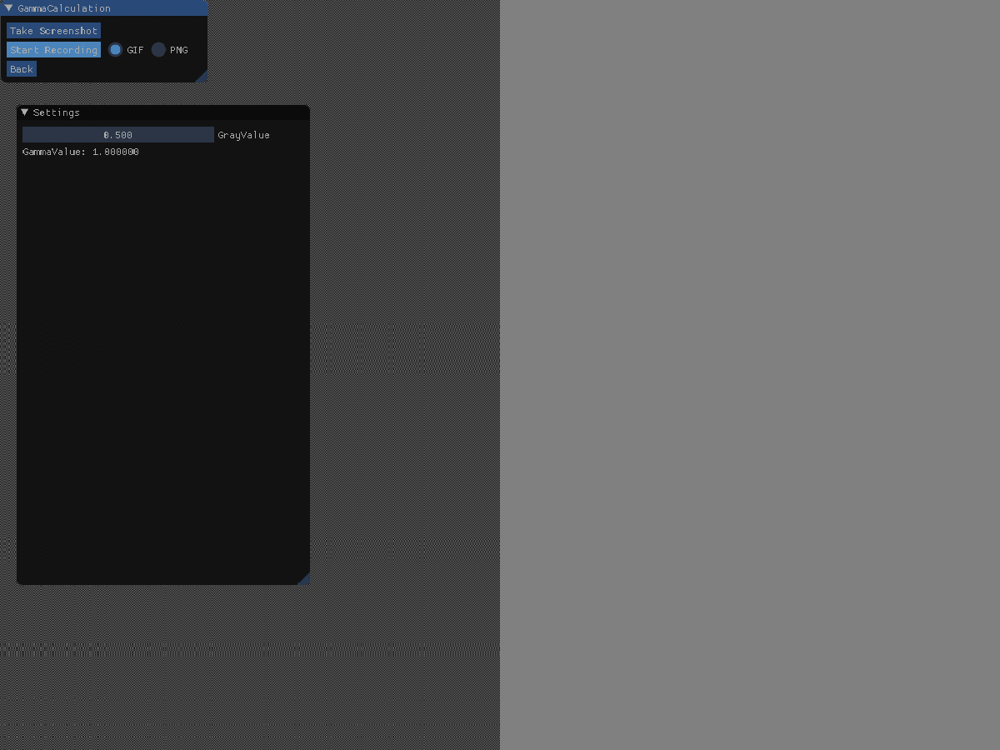
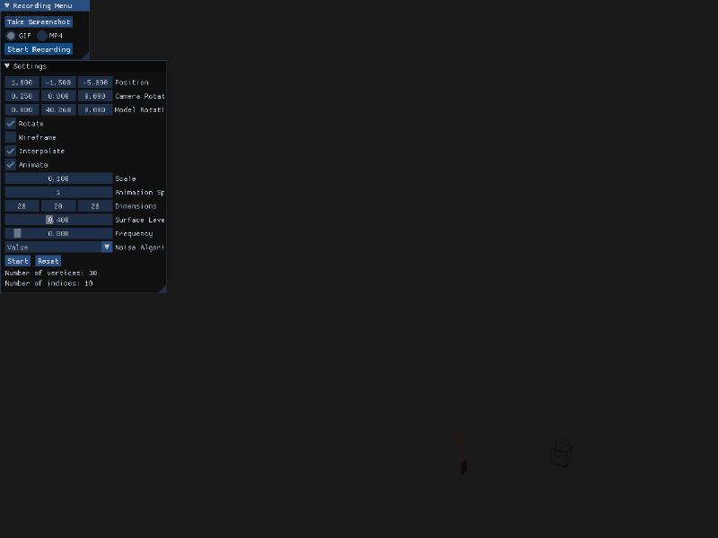
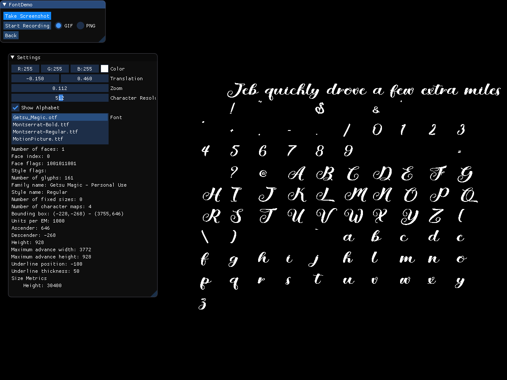
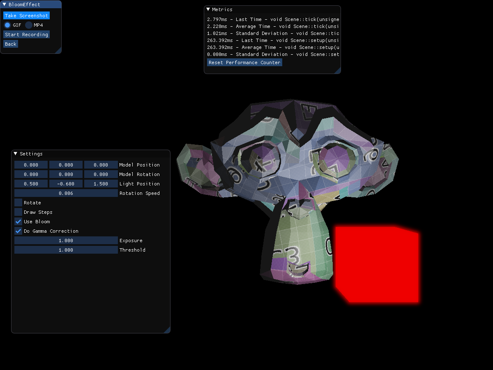
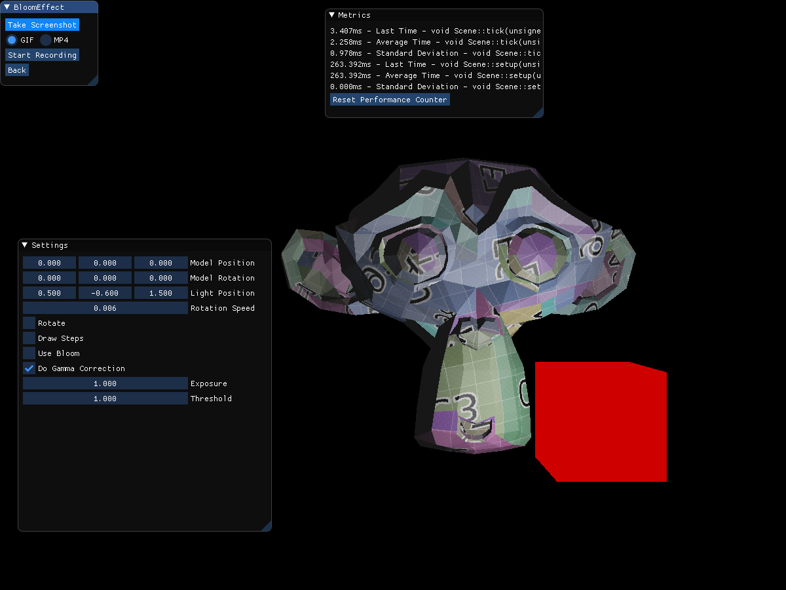
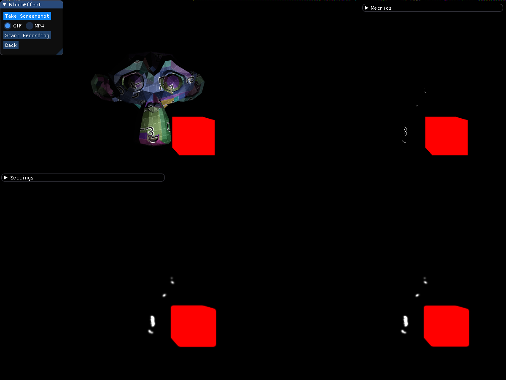
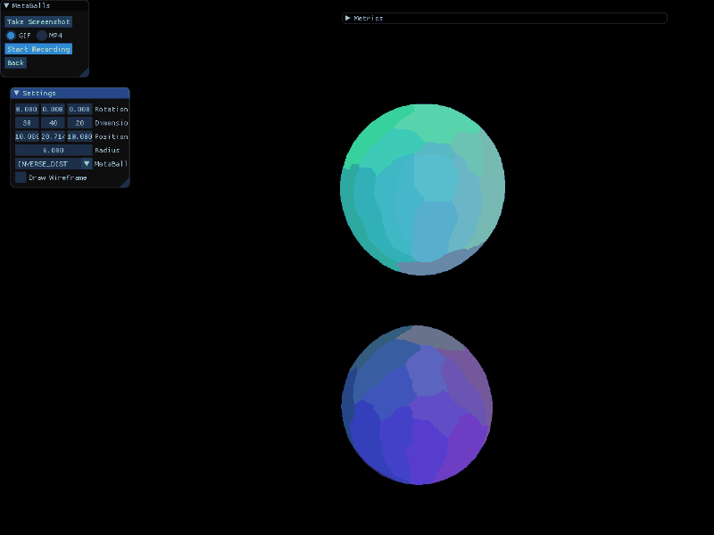
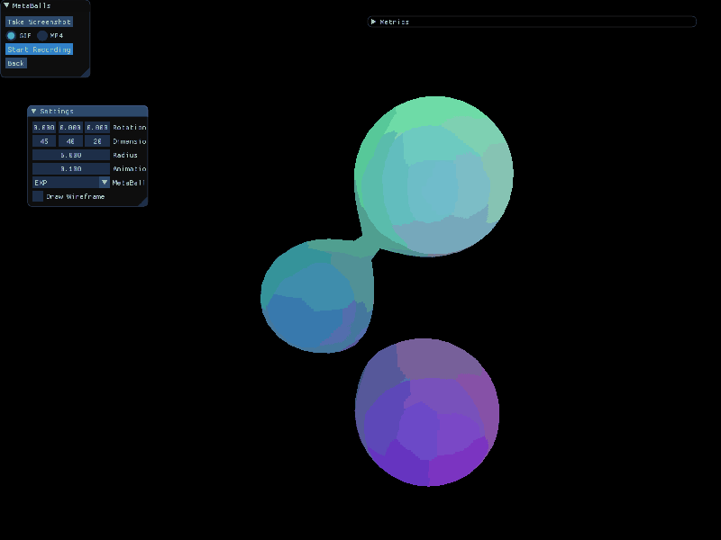
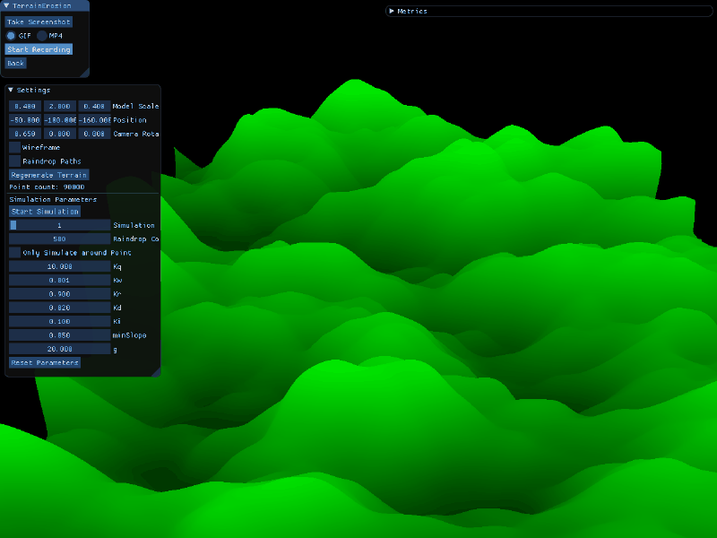

# Graphics Playground

In this project I'm trying out different graphics algorithms and visualizations.
Each scene has a small panel with settings which affect the algorithm in some way.
This way one can see the effect of different parameters in real time.

## Setup

1. Checkout the git repository recursively with `git clone --recursive ...`
2. Build the executable `make cmake build`
3. Run the executable `make run`

## Usage

Each Scene has a settings menu and a navigation menu.
To get back to the main menu, just press the back button in the navigation menu.

## Scenes

### Test Scene

Empty scene that demonstrates how to setup a scene.

### Legacy Triangle

Uses the legacy OpenGL fixed function pipeline to draw a simple triangle.

### Triangle

Uses the modern OpenGL shader pipeline to draw a simple triangle.

### Texture Demo

Demonstrates how to map a texture to a quad.

### Gamma Calculation

The gamma value of a display is the specific exponent of the displays color translation function.

### Cube

Shows a simple 3D cube.

### Landscape

In this scene a landscape is being generated from different noise algorithms.
The starting point is a completely flat plane.
Each vertex of that plane has a 2D position on the plane (ignoring the height for now).
We can take this 2D position and use it as an input for one of our noise functions.
Depending on the noise function that is selected, the resulting value can be more or less similar to values of neighboring positions.
Now we can use the value we have calculated for each position as the height at that position.

### Rubiks Cube

Here you can see a rubiks cube.
It can be shuffled by pressing a button.
A simple solving algorithm has also been implemented.
Each layer is solved one by one.

### Marching Cubes

Generating interesting terrains is a big part of most procedural games.
The marching cubes algorithm can be used to do just that.
The basis of this algorithm is a cube, from which we select corners.
Depending on which corners we selected, we add the corresponding vertices and thus triangles to the mesh.
A cube has 8 corners, thus we have 2^8 possible combinations of these corners.
From all these combinations we pre-generate a table that contains the corresponding vertices as explained above.
The next step is to place the small cube into the big volume.
This is where the marching comes into play.
The small cube moves through the big volume and at each position we decide for every corner of the cube whether it is inside of the terrain or outside of it.
To decide that, we use a function that accepts 3D coordinates and gives us a value between 0.0 and 1.0 back.
The surface of our terrain is then defined by a threshold between 0.0 and 1.0.
A corner of the small cube is inside the terrain if the value of the function is below the threshold.
For each position of the cube we use the result of checking each corner whether its inside the terrain or not to query the pre-generated table for the corresponding vertices.
If we do this for every possible position inside of the volume, then we'll get the surface of the terrain.
To make the surface less "blocky" we can use the result of the function to interpolate the vertex positions between the corners.
The end result looks something like this:

### Font Demo

This demo shows how to render fonts using freetype2.
The selected font is loaded into memory.
After that, each character is rendered into a bitmap.
These bitmaps are then used as texture for a quad.
To ensure correct placement, we have to save additional information, such as kerning, with each character.

### Model Loading

This is a simple `*.obj` file loader.
Just place any model that you want to load into `src/app/scenes/model_loading/models` and select it in the settings menu.
The loader is very simplistic and can only handle very simple models correctly.

### Light Demo

Shows what the Phong reflection model looks like.
The different components of the model can be switched on and off individually.
It is also possible to adjust the color of the ambient and specular components, as well as the light color.

### Fourier Transform

### Normal Mapping

Normal mapping or bump mapping is a technique to increase the visual fidelity of surfaces without increasing the complexity of the underlying mesh.
The idea is fairly simple. Instead of one normal per surface, we create one normal per fragment.
We can do this by pre-calculating them and storing them in a special texture called normal map.
The only thing we need to consider when applying the normal map, is the fact that the surface we are applying it to might not have the same orientation in space as the surface we created the normal map for.
This can be easily corrected by calculating the normal, tangent and bi-tangent vectors for the surface.
The end result can be seen below.

### A\*

A\* is a search algorithm that finds the shortest path from one point to another in a graph.
It uses a heuristic to improve the searching behavior.
We start out doing a breadth first search.
The only difference is that the queue that we are using is a priority queue.
The nodes in the priority queue are sorted by their total estimated distance to the target.
We get this value by keeping track of how far we have traveled so far and then adding whatever the heuristic says how far we are still away from the target.

### 2D Shadows

This demo shows how to cast shadows in a 2D environment.
The basic algorithm consists of 3 main parts.

#### 1. Ray casting

At first we cast rays from the light source into the scene.
We cast as many rays as we have corners of obstacles in the scene.

#### 2. Calculate closest intersections

Next we calculate the closest intersection point with any obstacle for each ray.

#### 3. Calculate light/shadow mesh

With this information we can go to the final stage of the process, calculating a mesh that covers the light area.
To cover the light area, we sort all the closest intersection points in a circle.
This ensures that two neighboring points in the array are also next to each other on an imaginary circle around the light source.
With the points sorted in this manner, we can simply draw a triangle fan around the light source.
This will then cover the whole lit area.

We can then use the stencil buffer to create the illusion of shadows.
This can be achieved by setting up the stencil in such a way that the lit area is the only area that passes the stencil test.
Thus the lit area is the only area that is drawn to. The rest of the scene lies in darkness.

### Ray Tracing

Calculating accurate lighting for a scene is a very difficult task.
One technique that can be used to do that is called ray tracing.
We place a virtual camera into our scene and then shoot rays from each pixel of the cameras sensor into the scene.
The color of whatever the ray hits is then written to the pixel where it originated.
This process is visualized, by rendering the whole scene from a different perspective than the ray tracing camera.
It is possible to adjust the cameras focal length and position.

#### Reflective surfaces

Surfaces such as glass, a mirror or even water can reflect light and thus create a reflection on them.
This can be simulated by creating new rays, which go off into the scene and record new color values.
In nature this would happen infinitely often, but since we only have limited computation time, we need to restrict this process.
This is done by only doing this light bounce a certain number of times and simply stopping after a certain depth is reached.

### Bloom Effect

When bright light sources illuminate a scene, they tend to "bleed" into their surroundings.

As you can see the red light seems to leek light into its surroundings and the features on the face of the monkey are being highlighted.
The second image does not have the bloom effect applied to it and thus the light looks quite flat.

How it works:

First, we render our scene into two buffers.
The first buffer will receive the colors normally.
The second buffer however will only receive colors that are brighter than a certain threshold.
The result can be seen in the image above, in the top two quarters.

In the next step we take the image with only the bright colors and blur it with a gaussian blur.

Lastly, we can combine the blurred image and our original scene again.
This will yield a subtle bloom effect around bright lights. and also some highlights on surrounding objects.

### Spot-Light Demo

- flash light
- tunnels to explore

### Metaballs

Metaballs are a form of implicit surface, which look very organic.
They are defined by a metaball function that is summed up over all the metaballs and then compared to a threshold.
In this case we have 3-dimensional metaballs, which means that the metaballs function takes 3 arguments (x, y, z) and produces a single output.
The implicit surface that is defined by this function is then approximated with the Marching Cubes algorithm.

### Terrain Erosion

This is a method to generate more realistic looking terrain.
We start out with a terrain that has been generated from a height map by layering noise textures with different frequencies.
Then we simulate rain falling onto the terrain.
Water is one of the main causes for erosion in nature (the other being wind).
Each rain drop is simulated and it will traverse the terrain, following the terrains gradient.
At each step in the simulation we either erode the terrain, i.e. take sediment away.
Or we deposit sediment onto the terrain.
This leads to the formation of nice ridges and smooth valleys.

Sources:
- [Terrain Erosion by Sebastian Lague](https://www.youtube.com/watch?v=eaXk97ujbPQ)
- [Implementation of a method for hydraulic erosion by Hans Theobald Beyer](https://www.firespark.de/resources/downloads/implementation%20of%20a%20methode%20for%20hydraulic%20erosion.pdf)
- [Water erosion on heightmap terrain by E-DOG](http://ranmantaru.com/blog/2011/10/08/water-erosion-on-heightmap-terrain)

### Digital Terrain Model Viewer

The digital terrain model of Saxony contains 40,000,000 points at a ground resolution of 2km.
It is not possible to upload all of these points to the GPU at once, at least not on lower end GPUs.
The solution is to upload only a small subset of the points to the GPU.
The ingestion pipeline looks like this:

- load all files and parse the raw points from them
- store the points as a raw batch in a queue
- take raw batches from the queue and process them into renderable batches
- store renderable batches in internal data structure for future use
- upload renderable batches, that are close to the camera position to the GPU

Both the loading of files into raw batches and the processing of raw batches into renderable batches is running completely parallel.
The queue for raw batches allows us to parallelize the loading and processing quite nicely.

### Graph Visualization

[Force-directed graph drawing](https://www.wikiwand.com/en/Force-directed_graph_drawing)
[Spring Physics](https://www.gamedev.net/tutorials/programming/math-and-physics/towards-a-simpler-stiffer-and-more-stable-spring-r3227/)
[Coulomb's Law](https://www.wikiwand.com/en/Coulomb%27s_law)

## Ideas

- Webcam Demo (show image from webcam and apply some post processing)
- Audio visualization (load wave file and play it, visualize amplitude over time)
- Surface Smoothing (Take the average of the normals of a vertex (find all normals that belong to a certain vertex))
- Water Demo
- Smooth-Min function (used to smoothly transition between two values)
    - h = clamp01((b-a+k) / (2*k))
    - return a * h + b * (1-h) - k * h * (1 - h)

## Additional Features

### Screenshots

The back menu offers the option to take screenshots of the current scene.
The screenshot is then saved to the projects working directory as `screenshot-%year%-%month%-%day%-%hour%-%minute%-%second%.png`.

### Screen Recording

The back menu offers the option to take screen recordings of the current scene.
Choose one of GIF or MP4 and press the `Start Recording` button.
After you're done recording, just press the `Stop Recording` button.
The recording is then stored in the projects working directory as `screenrecording-%year%-%month%-%day%-%hour%-%minute%-%second%.%extension%`
The extension is determined by the recording type you chose.

### Timing Utility

With the Timer and the PerformanceCounter, one can easily time functions and also benchmark their performance over time.
